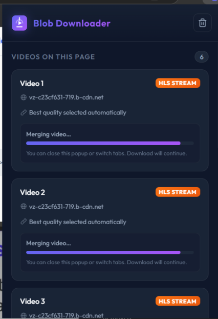

# # Protected HLS Downloader Extension

An extension for detecting, organizing, and downloading embedded, locked, private, or not exposed video streams from supported webpages.

> I created this project after experimenting with websites where videos were embedded, locked, private, or not exposed through a normal download button. The goal of this repository is to learn how HLS streaming, browser networking, Chrome extensions, and media downloading work - not to bypass DRM, account access controls, subscriptions, paywalls, or an organization's policies.

## # Screenshot



## # Features

- Detects HLS/M3U8 video streams from webpages
- Automatically selects the best available quality
- Orders detected videos based on their position on the webpage
- Displays videos as `Video 1`, `Video 2`, `Video 3`, and so on
- Downloads HLS segments in parallel
- Continues downloading when the popup is closed or another tab is opened
- Shows live download progress
- Supports multiple video downloads
- Fast popup opening with cached video detection

## # How It Works

```text
Webpage
   ↓
Media / HLS Requests
   ↓
M3U8 Detection
   ↓
Stream Grouping
   ↓
Page Order Matching
   ↓
Best Quality Selection
   ↓
HLS Segment Downloading
   ↓
Parallel Segment Fetching
   ↓
Video Merge
   ↓
Saved Video File
```

## # Why I Created This

While learning about browser networking and video streaming, I came across websites where video content was embedded inside custom players and the actual media files were not directly visible through a normal download button.

During development, I also tested situations involving embedded, private, locked, or protected-looking video players. Some video systems use authentication, signed URLs, DRM, encrypted media, subscriptions, or other access controls. This project is not intended to defeat those protections.

The purpose of this repository is educational: to understand HLS streaming and browser-extension development by building the downloader myself.

## # Important Notice

This project is intended for learning, development, testing, and downloading media that you are allowed to save.

It is **not designed to bypass DRM, authentication, subscriptions, paywalls, access restrictions, or other security mechanisms**.

Websites, video providers, and content owners may have their own terms, copyright rules, and technical restrictions. Users are responsible for using this project appropriately and respecting those requirements.

## # Tech Stack

- JavaScript
- HTML
- CSS
- Chrome Extension APIs
- Manifest V3
- HLS / M3U8
- Chrome Web Request APIs
- Chrome Downloads API
- Offscreen Documents
- Browser Storage

## # Installation

Clone the repository:

```bash
git clone https://github.com/dineshsinghdhami/protected-hls-downloader-extension.git
cd protected-hls-downloader-extension
```

Or download the repository as a ZIP and extract it.

Open Browser and go to:

```text
Browser://extensions/
```

Then:

1. Enable **Developer mode**
2. Click **Load unpacked**
3. Select the extension folder
4. Open a supported webpage containing HLS video
5. Refresh the webpage if necessary
6. Play the video briefly so the stream can be detected
7. Open the extension
8. Select the video you want to download

## # Project Structure

```text
protected-hls-downloader-extension/
├── background.js
├── offscreen.js
├── offscreen.html
├── popup.js
├── popup.html
├── styles.css
├── manifest.json
├── icon16.png
├── icon48.png
├── icon128.png
├── assets/
│   └── screenshot.png
├── README.md
└── .gitignore
```

> The exact filenames may vary depending on the current version of the extension.

## # Current Limitations

- The extension focuses mainly on HLS/M3U8 streams
- Some websites may use stream formats or player implementations that are not detected
- DRM-protected media is not supported
- Authentication-protected streams may depend on the website's own session and access rules
- Video and audio may be delivered separately on some platforms
- Some HLS streams may require additional remuxing for full MP4 compatibility
- Websites can change their player or network implementation at any time

## # Development Purpose

This repository is published as a learning project and as a record of my progress while studying browser extensions, networking, and video streaming.

It is not affiliated with any website, video platform, educational organization, CDN provider, or content owner.

If a website does not provide permission to download its content, users should follow that website's rules and the rights of the content owner.

## # Author

**Dinesh Singh Dhami**

GitHub: [github.com/dineshsinghdhami](https://github.com/dineshsinghdhami)
